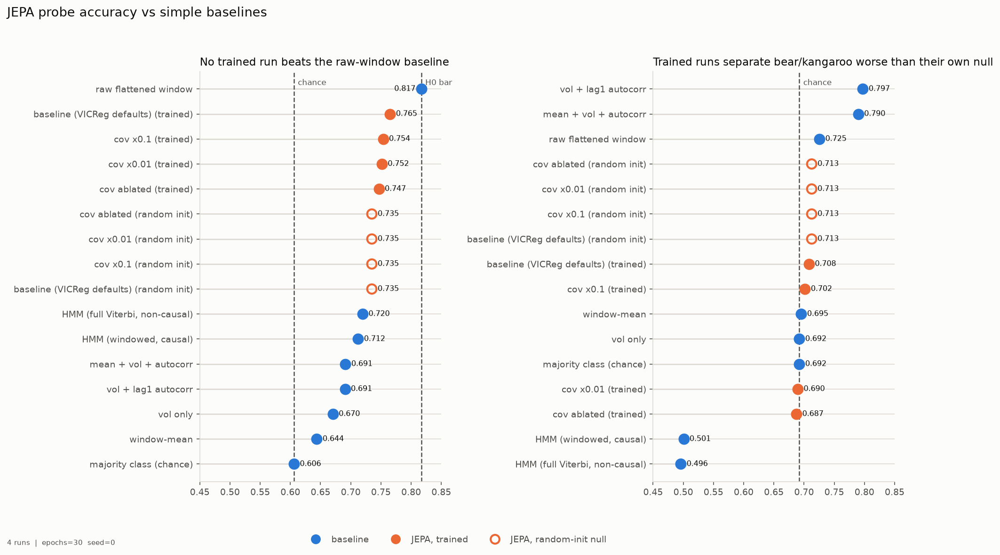
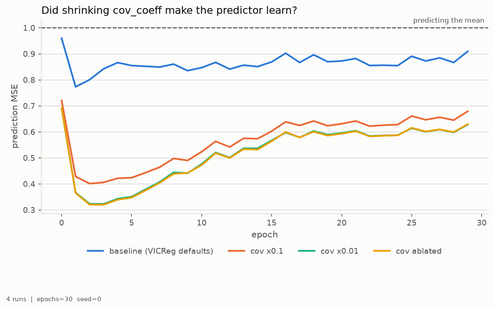
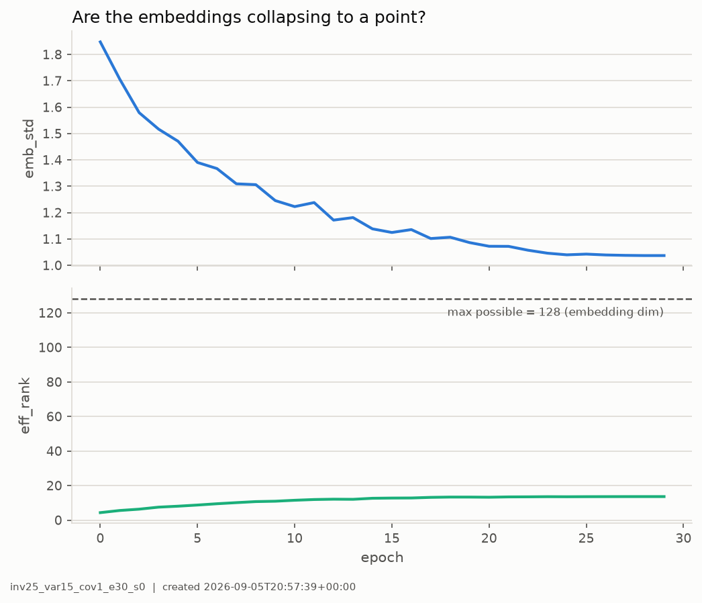

# hello-jepa

Infrastructure smoke test: does a JEPA trained with VICReg learn anything from a
synthetic financial time series whose ground truth we control?

This tests the *pipeline*, not a modelling result. The synthetic data exists so
that "did it learn anything" has a checkable answer.

## Hypothesis

> **H0** — A JEPA model using VICReg does not meaningfully explain more than a
> simple logistic regression on a raw flattened window.

**Result: H0 is not rejected, in every configuration tried.** No trained run beat
the raw-window baseline's 0.817, and on the temporal metric every trained run
scored *below* its own untrained control.

## Data (`src/HMM_data.py`)

A 3-state hidden Markov chain (bull / bear / kangaroo) driving four channels: log
returns, realized volatility, log volume, and a slow regime-independent drift.
Each channel is its own AR(1) with an **independent** shock — a shared shock would
let any model solve the task by isolating one common factor, so a module-level
assert keeps cross-channel correlation below 0.05.

| regime | share | dwell | σ (returns) | φ (lag-1) | log-vol mean |
|---|---|---|---|---|---|
| bull | 0.58 | 100 | 0.008 | +0.05 | 0.00 |
| bear | 0.11 | 29 | 0.022 | +0.35 | 0.55 |
| kangaroo | 0.31 | 36 | 0.022 | −0.30 | 0.35 |

T = 20,000 steps, 500 burn-in, cut into 19,437 windows of (64, 4). Split 70/30 by
time with 127 windows dropped between train and test; standardization fit on
training rows only. No window shares a timestep across the split.

**Why bear-vs-kangaroo is reported separately.** Bull is 58% of the data and has
2.75× lower volatility, so overall accuracy is dominated by an easy class. Bear and
kangaroo have *identical* return volatility and differ mainly in the **sign of their
lag-1 autocorrelation**, so separating them requires modelling how consecutive
timesteps relate, not just how large they are. It is the column that says whether
temporal structure was learned.

That claim is tested, not assumed: the `window-mean` baseline uses per-channel means
only and contains no temporal information by construction. It scores 0.695 against a
chance level of 0.692 — the log-volume mean offset (0.55 vs 0.35) leaks no usable
amplitude shortcut.

## Results

Every row is a multinomial logistic probe on a frozen representation, fit on train,
evaluated on the time-held-out test split.

| representation | test acc | bear vs kang |
|---|---|---|
| majority class (chance) | 0.606 | 0.692 |
| window-mean (amplitude only) | 0.644 | 0.695 |
| vol only | 0.670 | 0.692 |
| vol + lag-1 autocorr | 0.691 | **0.797** |
| mean + vol + autocorr | 0.691 | 0.790 |
| **raw flattened window (the H0 bar)** | **0.817** | 0.725 |
| HMM (windowed, causal) | 0.712 | 0.501 |
| HMM (full Viterbi, non-causal) | 0.720 | 0.496 |
| random-init encoder (null control) | 0.735 | **0.713** |
| JEPA + VICReg, cov=1 (defaults) | 0.765 | 0.708 |
| JEPA + VICReg, cov=0.1 | 0.754 | 0.702 |
| JEPA + VICReg, cov=0.01 | 0.752 | 0.690 |
| JEPA + VICReg, cov ablated | 0.747 | 0.687 |



The random-init control is what makes this readable. A frozen, *untrained*
transformer already scores 0.735, so comparing against chance (0.606) would have
shown a spurious +0.16 and the run would have been called a success.

## The coefficient sweep, and why it failed

The first run's diagnosis was that the covariance regularizer supplied 90.6% of the
total loss reduction while the prediction term supplied 3.1% — so the obvious fix
was to shrink `cov_coeff` and let prediction drive optimization. **That fix was
tried and it made things worse, monotonically.**

| run | cov_coeff | final pred MSE | test acc | bear vs kang |
|---|---|---|---|---|
| baseline | 1.0 | 0.909 | **0.765** | **0.708** |
| cov ×0.1 | 0.1 | 0.679 | 0.754 | 0.702 |
| cov ×0.01 | 0.01 | 0.628 | 0.752 | 0.690 |
| cov ablated | 0.0 | 0.630 | 0.747 | 0.687 |
| *random-init null* | — | — | *0.735* | *0.713* |

Prediction MSE improved by 31%. Probe accuracy fell. Bear-vs-kangaroo fell. **Better
prediction bought a worse representation**, and the ordering is perfectly monotone in
`cov_coeff`.

The obvious explanation — that decorrelated features merely condition a linear probe
better — is **wrong**. PCA-whitening the embeddings before probing changes nothing
(0.765 → 0.764 for cov=1; 0.747 → 0.745 for cov=0). The covariance term is
preserving real information, not just improving conditioning.

## Why prediction MSE is the wrong yardstick



Every run's MSE **bottoms out at epoch 1-3 and then gets worse**, while effective
rank climbs. Probing at each epoch shows what that actually means:

| epoch | pred MSE | eff_rank | acc | bear-v-kang |
|---|---|---|---|---|
| 0 | 0.960 | 4.31 | 0.740 | 0.710 |
| **1** | **0.773** (minimum) | 5.55 | **0.735** | 0.711 |
| 3 | 0.842 | 7.49 | 0.742 | 0.706 |
| 10 | 0.847 | 11.47 | 0.751 | 0.705 |
| 20 | 0.873 | 13.23 | 0.763 | 0.710 |
| **29** | **0.909** (worst) | 13.60 | **0.765** | 0.708 |
| *random-init null* | — | — | *0.735* | *0.713* |

**The MSE minimum is exactly where the representation is worst.** At epoch 1 the
probe scores 0.735 — identical to an untrained network. Accuracy improves
monotonically as MSE degrades. Early stopping on the loss would pick the worst
checkpoint available.

### Effective rank, and why more of it costs MSE

Effective rank is a soft count of how many independent directions the
representation uses: centre the (N x 128) embedding matrix, take singular values
s_i, normalise p_i = s_i / sum(s), then eff_rank = exp(-sum p_i log p_i). All
variance in one direction gives 1; spread evenly over all 128 gives 128. This
model ends at ~13.6, so it uses about 14 of its 128 available directions.

The target is **not fixed** — it is the EMA encoder's own output, so the model sets
its own exam, and the exam's difficulty is its rank. At rank 5 the 128 coordinates
are highly redundant: pin down ~5 numbers and the rest follow. At rank 14 there are
~14 independent quantities to get right, each still forced to unit variance by the
variance term. More independent things to predict at the same per-dimension
variance means higher MSE.

The degenerate limit makes it obvious: at rank 1 every dimension is the same number
up to scale, and a constant predictor scores MSE -> 0. That is collapse — a perfect
score for a worthless representation. What the sweep shows is the mild, continuous
version of the same pressure.

So the model always has an incentive to lower its loss by simplifying its own
target, and **the variance and covariance terms exist to fight exactly that**.
Rising MSE is the sign they are winning. It also explains the sweep: ablating `cov`
removed the force pushing rank up, the target got easier, MSE fell 31%, and the
representation got poorer.

## Which channels carry the signal — and which the predictor is paid to predict

Single-channel probes against each channel's one-step predictability:

| channel | lag-1 autocorr | 1-step R² | probe acc | bear-v-kang |
|---|---|---|---|---|
| log_ret | −0.095 | **0.009** | 0.610 | 0.703 |
| realized_vol | 0.992 | 0.983 | **0.804** | 0.692 |
| log_vol | 0.865 | 0.749 | 0.653 | 0.709 |
| slow | 0.989 | **0.979** | **0.595** | 0.692 |

Chance is 0.606. **The `slow` channel scores 0.595 — below chance, i.e. zero regime
information — while being 97.9% predictable one step ahead.** It is
regime-independent by construction (`B_SLOW` is a single dict with no state
lookup), so this is the design working as intended, but it hands the predictor a
free lunch: a quarter of the input channels can be nailed almost perfectly while
teaching the encoder nothing.

Worse, the slow channel is near-constant *within* a window. Its AR(1) time constant
is 100 steps against a 64-step window:

| channel | within-window sd | across-window sd | ratio |
|---|---|---|---|
| log_ret | 0.912 | 0.135 | 6.75 |
| realized_vol | 0.486 | 0.819 | 0.59 |
| log_vol | 0.831 | 0.506 | 1.64 |
| slow | 0.419 | 0.894 | **0.47** |

A ratio below 1 means the channel varies more between windows than inside one — it
presents as a fixed offset rather than a process the model can watch evolve.

The inversion is the point. `log_ret` carries the temporal signature that separates
bear from kangaroo, and it is by far the *least* predictable channel (R² = 0.009).
`slow` is almost perfectly predictable and carries nothing. **A latent-prediction
objective is rewarded for modelling `slow` and for ignoring `log_ret`** — precisely
backwards for the task we are probing.

The one channel that breaks the pattern is `realized_vol`, which is both highly
predictable (R² = 0.983) and the single most informative channel for overall
accuracy (0.804 alone, against 0.817 for all four together). But it scores 0.692 on
bear-vs-kangaroo — exactly chance. So it supplies the easy bull-vs-rest split and
nothing else, which is consistent with the JEPA's overall accuracy improving over
training while its bear-vs-kangaroo score never moves.

## Not collapse

`emb_std` stayed near 1.0 in all runs and never approached 0, and effective rank
*rose* over training (max possible 128). The representations are spread out; they
are simply not predictive of regime beyond what an untrained network already gives.



## Two things the baselines show

- **The HMM is the strongest principled baseline and is structurally blind.** 0.712
  overall — it has the correct 3-state structure, since the data really was generated
  by a Markov chain — but **0.501 on bear-vs-kangaroo, a coin flip**. A Gaussian HMM
  treats observations as conditionally independent given the state, so it cannot
  represent within-regime autocorrelation. Unlimited non-causal context does not help
  (full Viterbi: 0.496). A model-class limit, not a context-length one.
- **The raw-window baseline is strong overall but weak temporally** (0.817 / 0.725)
  because lag-1 autocorrelation is a *second-order* statistic — a product of two
  timesteps — which a linear model on raw inputs cannot compute. Hand-feeding it gets
  0.797. That gap is the room a working sequence model should be filling.

## Verdict on the infrastructure

The pipeline works: generator validated against its own parameters, no leakage, EMA
target encoder and stop-gradient training stably, collapse instrumentation live,
probes and controls in place, runs versioned and reproducible. It produced an honest
negative result and then falsified its own first explanation for that result, which
is what a smoke test is for.

## The masking scheme

The encoder splits each 64-step window into **8 non-overlapping patches of 8
timesteps**. Each patch flattens its 8x4 = 32 values through `nn.Linear(32, 128)`,
picks up a learned positional embedding, and passes through a 4-layer transformer.
Training samples **one contiguous target block of 2-4 patches** (16-32 timesteps),
uses the remaining 4-6 patches as context, and asks a 2-layer predictor to
reconstruct the target patches' *embeddings* from the context plus learned mask
tokens. The same block is used for the whole batch.

**Patch length is not what blocks the autocorrelation signal.** 8 timesteps gives 7
consecutive pairs and the full window gives 63, which is ample to estimate a lag-1
correlation whose true magnitude is 0.30-0.35. The transformer's attention and MLP
layers are nonlinear and can compute the required products; `Linear(32, 128)` is an
expansion, so no information is destroyed at the patch-embedding step.

What is missing is **incentive**. Nothing in the objective rewards computing a
second-order statistic, and per the channel table above the objective actively
rewards the opposite: modelling the near-constant, uninformative `slow` channel
instead of the noisy, informative `log_ret` one.

## Next steps

Ranked by what would actually change the answer:

1. **Drop or shorten the `slow` channel.** It is regime-independent, scores below
   chance on its own, is 97.9% predictable, and is near-constant within a 64-step
   window (time constant 100 steps). It is free loss reduction that teaches the
   encoder nothing. Either remove it, or lengthen the window past its time constant
   so it presents as a process rather than an offset.
2. **Make the prediction target something autocorrelation-bearing.** The current
   objective can be satisfied without ever representing the sign of phi. Predicting
   across a temporal gap, or predicting a longer horizon than 8-step patches, would
   at least require the model to know which way the series tends to turn.
3. **Fix the progress metric.** Rank-normalise the prediction loss, or score against
   a frozen target encoder, so MSE becomes comparable across runs and epochs. There
   is currently no trustworthy scalar to tune against — see the epoch table above.
4. Only then compare against 0.817 again. The number to care about is
   bear-vs-kangaroo above 0.725, and it has not moved off 0.71 in any run yet.

**Closed:** early-stopping at the MSE minimum was tested and is refuted — epoch 1
probes at 0.735, exactly the untrained null, versus 0.765 at epoch 29.

## Layout

```
src/HMM_data.py     synthetic generator, validation, windowing, time-split
src/jepa.py         patch encoder, EMA target encoder, predictor, training loop
src/probes.py       baselines, HMM, null control, linear probes
src/experiment.py   versioned sweep runner
src/figures.py      figure generation
src/vicreg_loss/    vendored from github.com/jolibrain/vicreg-loss (MIT, JoliBrain)

runs/baselines.json          cached non-JEPA baselines
runs/<run_id>/metrics.json   history + probe results for one run
runs/manifest.json           every run_id
figures/<run_id>/*.png       per-run figures
figures/sweep/*.png          cross-run comparisons
```

Run ids encode their own configuration — `inv25_var15_cov0.1_e30_s0` is
`inv_coeff=25, var_coeff=15, cov_coeff=0.1, epochs=30, seed=0` — and every figure
carries its run id and timestamp in the footer, so any chart traces back to the run
that produced it.

```bash
uv run python src/HMM_data.py            # regenerate + print generator validation
uv run python -m src.experiment          # run the full sweep (cached; --refresh to redo)
uv run python -m src.figures             # regenerate all figures
```

Seeded throughout (seed 0); the numbers above reproduce.
